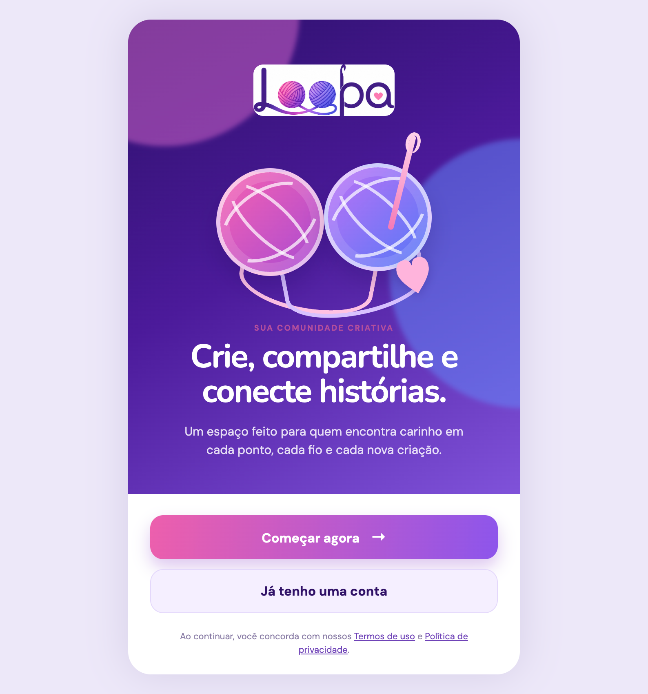
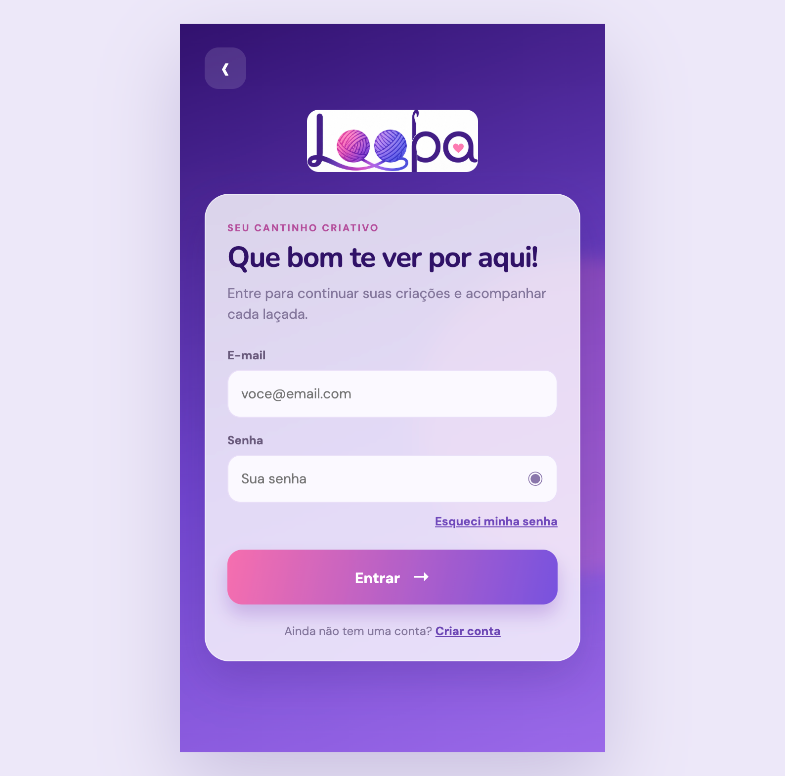
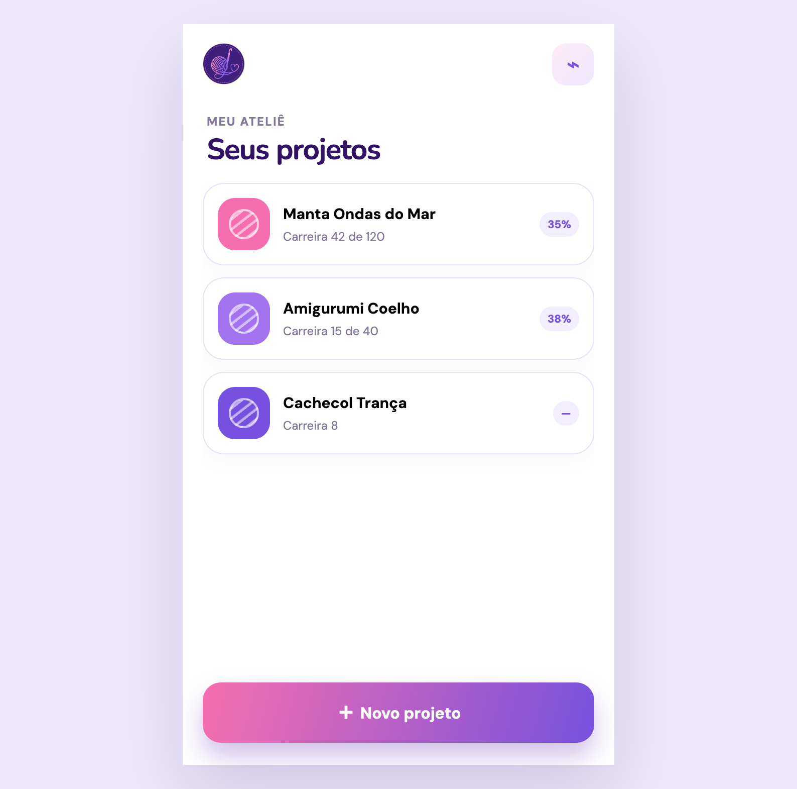
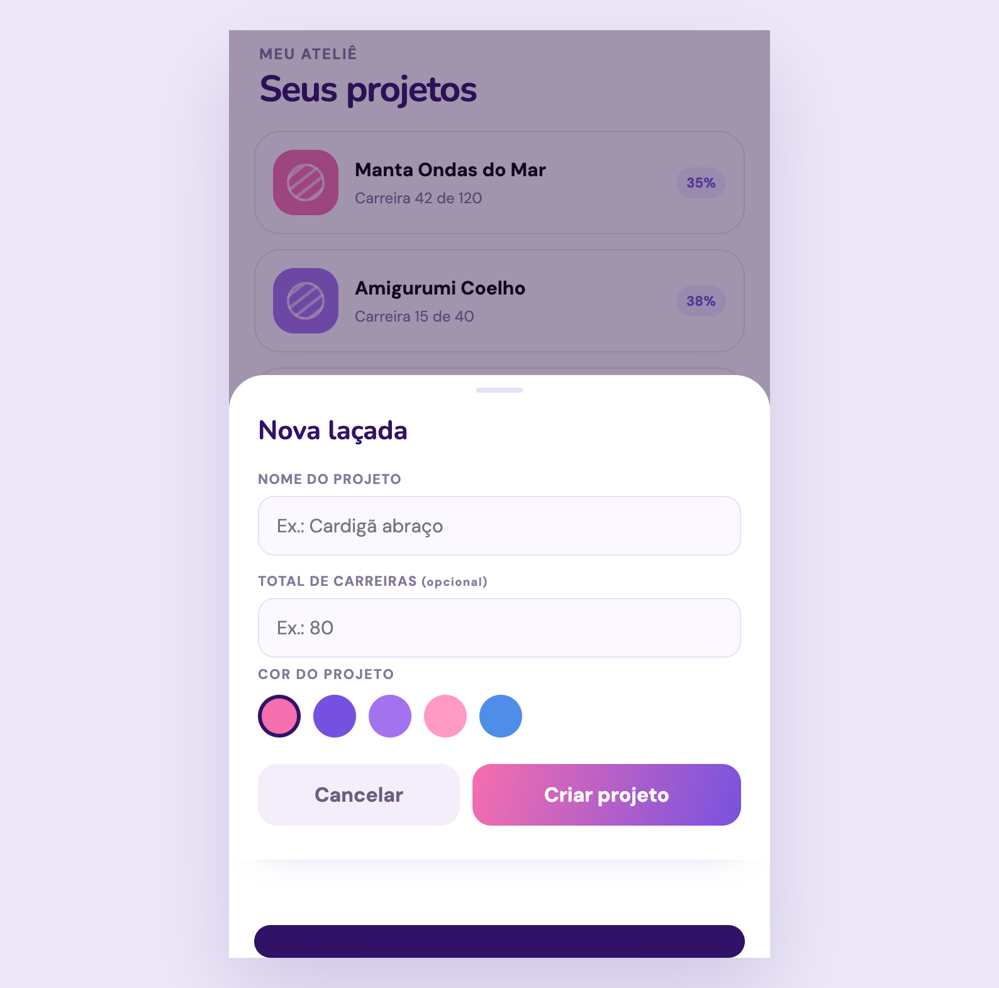

# Loopa

> A creative nook for keeping track of every stitch.

**Loopa** is a front-end prototype for people who create with yarn — including crochet, knitting, and amigurumi makers. It brings project tracking, row counting, materials, and pattern notes together in a light, welcoming experience.



## Key features

- Welcome and sign-in screens;
- Project list with progress calculated from completed rows;
- New-project creation with a name, optional row goal, and custom color;
- Project detail view with a counter, pattern notes, and materials;
- Controls to increase or decrease the row count;
- Visual feedback for device-level saving;
- Responsive, mobile-first interface.

## Preview

| Welcome | Sign in |
| :---: | :---: |
|  |  |

| Projects | New project |
| :---: | :---: |
|  |  |

## Technologies

- HTML5
- CSS3
- JavaScript (ES6+)
- Google Fonts — DM Sans and Nunito

The project uses no libraries, frameworks, build process, or installable dependencies.

## Getting started

1. Clone this repository or download the files.
2. Open `welcome.html` in a modern browser.

Because this is a static prototype, you do not need to install packages or start a server. For a smoother development experience, you may also use an extension such as Live Server.

## Project structure

```text
loopa/
├── assets/                 # Brand assets, icons, and screen previews
├── styles/
│   ├── index.css           # Application style imports
│   ├── welcome.css         # Welcome-screen styles
│   ├── login.css           # Sign-in-screen styles
│   └── projects.css        # Project-area styles
├── welcome.html            # Landing page
├── app.js                  # Landing-page navigation
├── login.html              # Sign-in screen
├── login.js                # Sign-in interactions
├── projects.html           # Project dashboard and details
└── projects.js             # Project state and interactions
```

## Current prototype status

The sample projects and any projects created during use are kept in memory only. As a result, reloading the page restores the initial state. The sign-in and sync messages are interface demonstrations and are not yet connected to authentication or a database.

## Suggested next steps

- Persist projects with `localStorage` or an API;
- Implement real authentication and account creation;
- Fix navigation links to provide a complete flow across all screens;
- Add project editing and deletion;
- Create interface and behavior tests.

## AI-assisted development

This project was created with Artificial Intelligence as a collaborative development tool. AI assisted with ideation, structuring, and implementation of the prototype; product decisions, creative direction, and final validation remain the responsibility of the project author.

## License

This project does not yet have a defined license. Before reusing or distributing it, please add an appropriate license.

## Author

<div align="center">

## **Graziela Jordana Mussato**

**Front-End Developer**

Passionate about building modern, responsive, and accessible web interfaces while continuously improving my Front-End development skills.

<p>

<a href="https://github.com/mussatograziela">

</a>

<a href="https://www.linkedin.com/in/graziela-mussato">

</a>

</p>

</div>

---

<div align="center">

⭐ If you found this project interesting, consider giving it a star!

</div>
